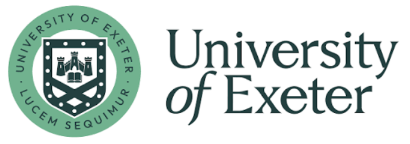
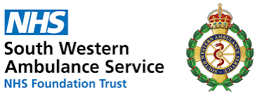

# ambforecast-intern

This internship explores whether time-series forecasting methods from the [Nixtla ecosystem](https://nixtlaverse.nixtla.io/) can improve forecasts of ambulance demand. Using historical ambulance response data, the project evaluates selected Nixtla models and compares their performance with established ARIMA and Prophet benchmarks.

<br>

## Background

This internship builds on a long-running collaboration between the Peninsula Collaboration for Health Operational Research and Data Science (PenCHORD) group at the University of Exeter and the South West Ambulance Service (SWAST).

<p align="center">
  
&nbsp; &nbsp; &nbsp; &nbsp;
  
</p>

Together, the teams have developed and evaluated forecasting methods for daily ambulance demand. This work was reported in:

> Monks, T., Harper, A., Allen, M. et al. Forecasting the daily demand for emergency medical ambulances in England and Wales: a benchmark model and external validation. BMC Med Inform Decis Mak 23, 117 (2023). https://doi.org/10.1186/s12911-023-02218-z

The code, data and results from the original study are available in the [swast-benchmarking GItHub repository](https://github.com/TomMonks/swast-benchmarking).

In 2026, we are revisting and extending this work. We are re-evaluating the original methods using more recent data, and investigating whether forecasts can be improved through alternative methods and additional predictors. This internship forms part of that broader programme of work. Related development is available in the [ambforecast repository](https://github.com/ambmodels/ambforecast).

<br>

## Data

The project uses daily ambulance response counts from 2013 to 2019, from the [original study](https://doi.org/10.1186/s12911-023-02218-z). A copy of that dataset is included in this repository:

```
data/Daily_Responses_5_Years_2019_full.csv
```

<br>

## Funding

The internship is funded by the [NIHR Exeter Biomedical Research Centre](https://www.exeterbrc.nihr.ac.uk/).


Supervisor time is supported by the by the Medical Research Council [grant number MR/Z503915/1]. It is also supported by the National Institute for Health and Care Research (NIHR) under the NIHR Applied Research Collaboration South West Peninsula (Grant Reference Number NIHR200167). The views expressed are those of the author(s) and not necessarily those of the NIHR or the Department of Health and Social Care.

<p align="center">
  
&nbsp; &nbsp; &nbsp; &nbsp;
  
</p>